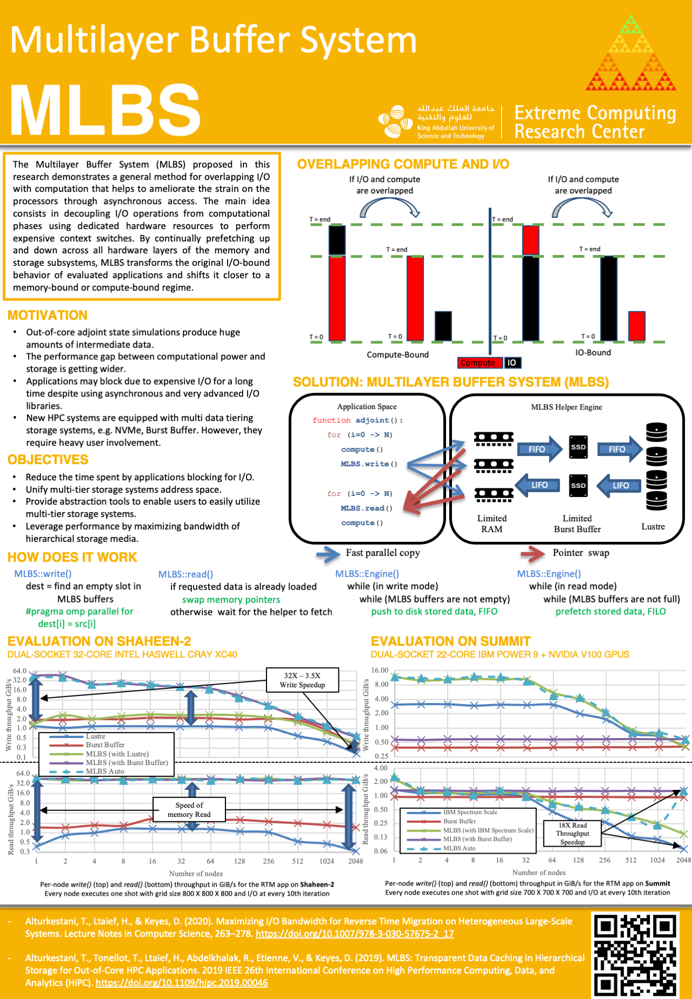

MLBS
============

#### Introduction
The Multilayer Buffer System (MLBS) proposed in this research demonstrates a general method for overlapping I/O with computation that helps to ameliorate the strain on the processors through asynchronous access. The main idea consists in decoupling I/O operations from computational phases using dedicated hardware resources to perform expensive context switches. By continually prefetching up and down across all hardware layers of the memory and storage subsystems, MLBS transforms the original I/O-bound behavior of evaluated applications and shifts it closer to a memory-bound or compute-bound regime.


#### Installation & compilation
To compile the code simpley run the makefile. If You are using a Cray system 
with a Burst Buffer don't forget to load the Datawarp module first


#### Usage
* make sure to include `#include<Storage.h>`
* initialize the MLBS using the following function calls:
```
mlbs::Storage myStorage; 
myStorage.setHelperCoreID(##);
myStorage.setTimeSteps(##);
myStorage.setSnapRatio(##);
myStorage.setNumOfIOSnaps(##);
myStorage.setSnapSize(##);
myStorage.setMaxNumOfSnapsInRam(##);
myStorage.setL2NumOfSnaps(##);
myStorage.setSnpFileName(##);
myStorage.setL3PathName(##);
myStorage.init();
``` 
* use `myStorage.write(label, data, dataSize);` to write to MLBS
* use `myStorage.read(label, data, dataSize);` to read from MLBS

#### Examples
The example code in `driver.cpp` shows how to use the MLBS in for an adjoint state simulation where the code 
first writes a number for snapshots in FIFO order then reads them back in a LIFO order.
To run the code, first compile it then simply run

```sh
export OMP_NUM_THREADS=32
./fakeRTM
```

#### TODO
* Add GPU support
* Provide Out-Of-Core (OOC) support for linear algebra workloads
* Implement an autotuner

#### References
1. Alturkestani, T., Ltaief, H., & Keyes, D. (2020). Maximizing I/O Bandwidth for Reverse Time Migration on Heterogeneous Large-Scale Systems. Lecture Notes in Computer Science, 263–278. https://doi.org/10.1007/978-3-030-57675-2_17

2. Alturkestani, T., Tonellot, T., Ltaief, H., Abdelkhalak, R., Etienne, V., & Keyes, D. (2019). MLBS: Transparent Data Caching in Hierarchical Storage for Out-of-Core HPC Applications. 2019 IEEE 26th International Conference on High Performance Computing, Data, and Analytics (HiPC). https://doi.org/10.1109/hipc.2019.00046

#### Help
Please feel free to create an issue on Github for any questions and inquiries.


